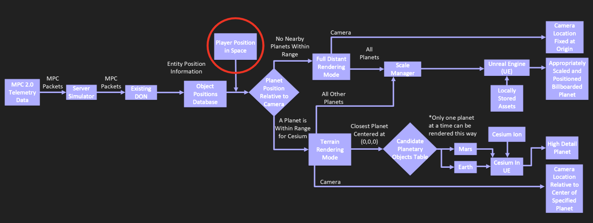

## Introduction

/// caption
This is the portion of the Block Diagram that deals tracking the camera position.
///

The one object position the [ObjectInfoStore](../object-state-tracking/index.md) doesn’t directly track is the **player camera**, but we need it to detect which rendering mode we need to be in.

We had to completely transform the way that the player's camera works in Unreal to implement our solution. Before, DON took any user movement inputs and directly added them to the player actor through a ‘movement input’ event. Now, the camera's position changes dependent on the [rendering mode](../rendering-modes/index.md) that the user is in.

## Overview

In a typical Unreal game, the up/down/left/right/forward/backward keys in a first person game update the player's position (player vector) as well as the player's camera. Ours is not that simple. The camera behaves differently depending on the rendering mode.

In close rendering mode, the player behaves in a more normal way-- updating its position based on the player's keyboard input. However, in distant rendering mode, the player's camera is locked at the origin (0, 0, 0) of the Unreal world. The movement vectors associated with player keyboard input are not applied to the camera anymore. Instead, these vectors are used to move & scale planets (using the Scale Manager) to give the illusion of movement.

With the offset vector and the parent we can calculate the camera’s position relative to any other object, which enables us to use it to move the player in terrain rendering mode, and move space around the origin locked player camera in distant rendering mode. Since the underlying position is the same, both modes now look the same to the player.

/// caption
This diagram shows how the camera worked in DON **before** our group vs. how it works **after** our design updates.
///

## Distant Rendering Mode

In distant rendering mode, we have the player camera fixed at the origin though, so we couldn’t have player inputs directly moving the camera. To remedy this we instead have these inputs update an offset vector of the player’s position relative to its parent.

This technique is called **Floating Origin**. Floating origin is a technique used in 3D environments, especially games, to counteract floating-point precision errors that occur when objects are rendered far from the origin (\(0,0,0\)). It works by keeping the camera at the world origin and shifting all other game objects accordingly when the camera travels too far, preventing glitches like jittering and flickering.

Shifting origin system

## Close Range Rendering

In close rendering mode, the Cesium version of the planet is positioned at the center of the Unreal coordinate plane instead of the player camera. As a result, the camera must then be shifted to the equivalent position relative to the planet, just not at the origin. This origin shifting is achieved using simple vector math.

Motion in ‘full’ distant rendering mode is a bit of an illusion. The camera never actually moves from the origin. Instead, keyboard inputs lead to updates in the player’s sun relative position. This is all handled by a subsystem known as the Solar Position Manager. This subsystem tracks and updates the positions of all objects, including the player camera, relative to the sun or the ultimate parent object. This task is executed every execution tick, and performs the acceleration and gradual deceleration math for the player camera in addition to calculating all other object positions. To calculate positions for standard objects, the system walks down the parent-child tree and adds up the position of each attached object to get an absolute position. These positions are stored in two different hash maps, each tying an object’s name to a vector storing x/y/z position. This subsystem is actually always running, but only handles all player movement activities in full mode. Otherwise, the player camera’s position is calculated based on the UE5 position of the player relative to the active Cesium object.

## To Delete

The player vector, or the player's position, is constantly being -tracked by the Solar Position Manager-, a system we created to keep track of objects' positions relative to the Sun. When the user uses their keyboard to move the player up, down, left, right, forwards and backwards, those inputs update the player vector relative to its parent object (which is either the Sun, if in distant rendering mode, or a planet, if in close rendering mode). Those positions are stored in the Global Position Manager (GPM). The GPM detects the rendering mode to use.
