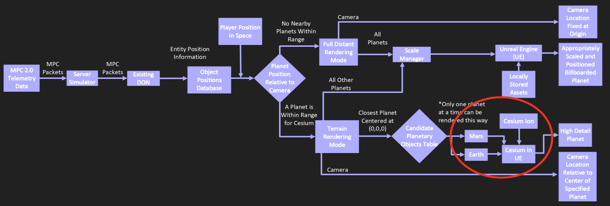

# Close Range Rendering

> Also referred to as: **Planetary Rendering Mode**, **Terrain Rendering Mode**, **Close-Range Rendering Mode**, or **Close-Range Terrain Rendering Mode**.
>
> All of these terms describe the same rendering system responsible for high-detail planetary visualization using Cesium.

---

/// caption
This is the portion of the Block Diagram that deals with close range terrain rendering.
///

## Overview

The **close-range terrain rendering system** handles **high level of detail (LOD)** planetary rendering using the **Cesium for Unreal** plugin.  
This mode activates when the player camera approaches a planetary body within a defined **distance threshold**.

While **close-range rendering** is active, only **child objects of the currently active planetary object** are rendered.  
This includes:

- Objects whose parents are children of the active planet (e.g., a space station orbiting Earth and its shuttle child).
- But **not** children of other planetary bodies (e.g., the Moon’s children while Earth is active).

Only **one Cesium planetary object** can be rendered at a time.  
Due to the large distances between planetary bodies in the solar system, the player can never be within the close-range rendering cutoff of two planets simultaneously.  
If this condition were somehow forced, the planet **closest to the player** would render using Cesium, and the other would be **billboarded**.

> **Billboarding** remains active in close-range rendering mode.  
> The difference is that the “billboard dome” is **centered at the player’s position**, which may not always coincide with the Unreal world origin.

---

## Detailed Design

### Terrain Rendering

Planetary terrain rendering is accomplished through the **Cesium plugin**, which generates and manages a planetary **ellipsoid** using two types of input data:

- **Terrain data** — defines elevation (height of the terrain at each point).
- **Imagery data** — provides surface imagery of that terrain.

These inputs are combined into a Cesium-specific format called **3D Tiles**, which allows **on-demand loading** of terrain data and **automatic level of detail (LOD)** management as the camera zoom level changes.  
This greatly reduces both **performance overhead** and **implementation complexity** compared to a manual system.

---

### Data Source and Preparation

Our initial design objective was to use **locally stored 3D Tile data**. However, we were unable to get this working so, we initial are currently using **streamed Cesium ion data**.

---

### Cesium Asset Management

Within Unreal Engine, Cesium data is represented as a **Cesium asset**.  
When a simulation loads, **DON** reads its metadata file to determine which assets must be instantiated.

The following object names act as **keywords**:

- `Moon`
- `Earth`
- `Mars`

If any of these appear, DON automatically treats them as **Cesium-enabled planetary objects**, allowing **close-range rendering mode** to be activated for them.

Candidate planetary objects are stored in a **tracking table** and have their **Sun-relative positions** updated every frame to determine whether they should trigger close-range rendering.

---

### Activation and Mode Transition

Close-range rendering is triggered when the player camera comes within a **specific distance threshold** of a planetary object’s center.

Because distant planets are **billboarded at fixed distances** in **distant rendering mode**, the system cannot rely on Unreal Engine world distances.  
Instead, **solar coordinate plane distances** are used to determine proximity.

#### When entering close-range rendering mode:

1. A **mode flag** is set.
2. The **active planetary object** is recorded.
3. The **billboard** for that planet is unloaded.
4. The **Cesium asset** for the same planet is loaded using the same **solar coordinate position**.
5. The Cesium planet is positioned at the **center of the Unreal Engine world**, not at the player’s position.
6. The **camera** is shifted to the equivalent location relative to the planet’s surface, using simple **vector math**.

This transition produces a **nearly seamless effect**, with only minor differences in:

- **Terrain loading delay**, and
- **Texture appearance** between billboard and Cesium renderings.

---

### Rendering Behavior While Active

Once in close-range mode:

- Only **children** of the **active Cesium planet** (and their subchildren) are rendered.
- **Children of other planets** are ignored.
- **Only one** Cesium planet can be active at once.
- Distant objects remain visible as **billboards**, but the billboard dome centers around the **player’s position**, not the world origin.

This ensures continuity in perspective and performance even as rendering mode transitions occur dynamically.

---

## Summary

Close-range terrain rendering provides:

- **High-fidelity planetary surfaces** using Cesium.
- **Smooth transitions** between distant and close-range views.
- **Efficient asset management** with local 3D Tiles.
- **Hierarchical rendering rules** ensuring clarity and performance.

Through this mode, **DON** achieves an immersive and efficient visualization of planetary environments while maintaining a seamless experience during movement across vast celestial distances.
