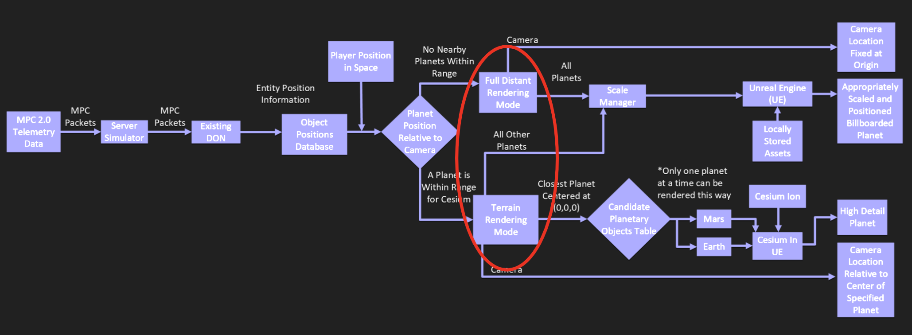
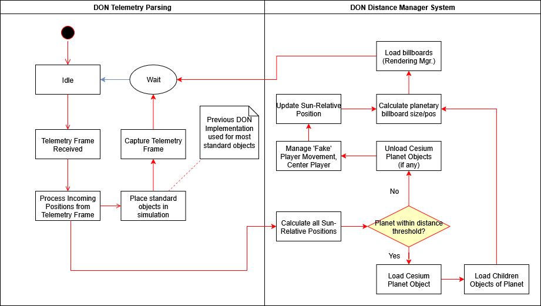

# Rendering Modes

/// caption
This is the portion of the Block Diagram that deals with updating the rendering mode based on the player's position.
///

## Mode Transitions

Smooth transitions between rendering modes were achieved through the **Level Transition System**, which runs at a high rate on the game tick. This system uses a generic **Actor Placer** reference and operates entirely within a single Unreal Engine 5 (UE5) level.

By consolidating to one level rather than two, we significantly reduced performance overhead and allowed transitions between rendering modes to occur seamlessly.

Within the view at any given time, some objects can exist in **terrain (close-range) rendering mode** while others are **billboarded (long-range rendering mode)**.  
For example, when near the surface of Earth, the Moon can remain visible in the distance as a billboard.

---

## System Design

Our design has two primary components with an **integration/transition layer** between them, enabling smooth on-the-fly switching between rendering modes.

When crossing a specified **distance threshold** to a planetary object:

- The object is marked for **close-range rendering**, and
- Loaded as a **Cesium** asset.

> Cesium is an Unreal Engine plugin that allows high-detail, 1:1-scale rendering of entire planetary bodies.

When in close-range mode, the **Unreal Engine world origin** is re-centered at the planet’s core.  
This simplifies the placement of nearby simulation objects.

When leaving the distance threshold:

- The Cesium planetary object is **unloaded**, and
- Replaced by a **billboard model** representing the same object in the distance.

---

## Object & Player Positioning

A central table tracks the positions of all solar system objects.

- The **Sun** (or, if absent, the parent of all objects) is always at **(0, 0, 0)**.
- The **player’s position** depends on the rendering mode:
  - **Close-range mode:** Calculated relative to the active planetary object.
  - **Distant mode:** The player remains fixed at the Unreal origin, while “movement” updates occur in a **secondary solar coordinate plane**.

Because other objects’ placements are computed from this **solar placement system**, the player perceives smooth movement even though no true Unreal-space translation occurs.

The **transition distance** between modes is determined using **Sun-relative positions** in the solar coordinate plane, not Unreal coordinates.

---

## Telemetry Integration

Initial telemetry parsing occurs in the legacy DON implementation.  
Once parsing completes, the system computes **Sun-relative positions** for all output data.

Distances derived from these positions trigger either:

- **Full distant rendering mode**, or
- **Limited distant rendering mode.**

### Mode Behavior

- **Limited distant mode:**

  - Loads/unloads Cesium objects as required.
  - Loads all relevant **child objects** of the active planet.

- **Full distant mode:**
  - Locks the player at the Unreal origin.
  - Movement inputs are paused or faked.
  - Position updates are instead handled by the **Solar Position Manager**.

Both modes ultimately converge to the same task:

> Calculating placement of distant objects for **billboarding**.

---

## Activity Diagram

_Activity Diagram – Describes the general sequence flow during execution of telemetry parsing and rendering._

---

## Full Process

1. **New telemetry frame** is parsed.
2. Compute **Sun-relative positions** for all simulation objects.
3. Based on calculated distances, determine whether to trigger **full** or **limited** distant rendering mode.
4. If **limited distant mode**:
   - Load/unload Cesium objects as needed.
   - Load any **child planetary objects**.
5. If **full distant mode**:
   - Player locks to origin.
   - Movement updates are paused or faked and tracked in the **Solar Position Manager**.
6. Both modes return to the same task — **billboarding distant objects**.
7. Billboarded objects are loaded using the **Rendering Manager**, which takes asset references, positions, and scale factors as inputs.
8. Flow returns to the main execution thread, where the current telemetry frame has been captured and stored.  
   The **DON** then waits for the next frame to repeat the cycle.
